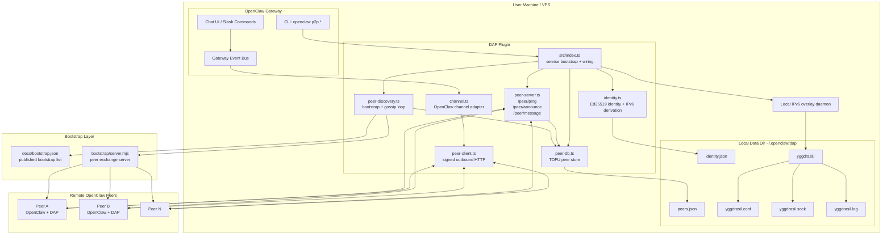
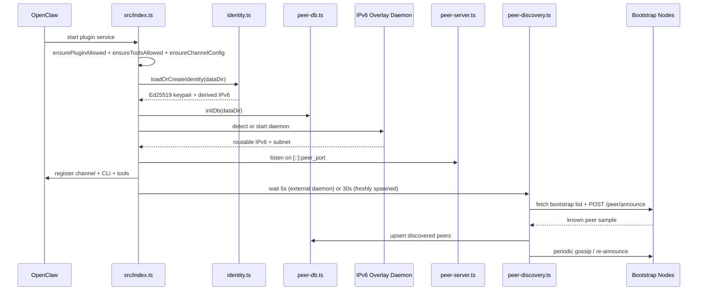
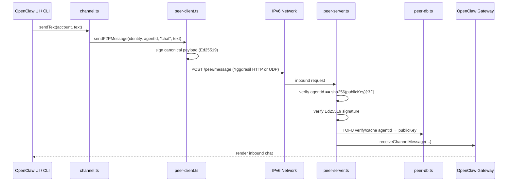

<p align="center">
  <a href="https://github.com/ReScienceLab/dap/releases"></a>
  <a href="https://www.npmjs.com/package/@resciencelab/dap"></a>
  <a href="https://discord.gg/JhSjBmZrqw"></a>
  <a href="LICENSE"></a>
  <a href="https://x.com/Yilin0x"></a>
</p>

Direct encrypted P2P communication between [OpenClaw](https://github.com/openclaw/openclaw) instances. QUIC transport works out of the box — add [Yggdrasil](https://yggdrasil-network.github.io/) for cryptographic overlay routing and NAT-free global mesh.

**No servers. No middlemen. Every message goes directly from one OpenClaw to another.**

---

## Demo

Two Docker containers join the real Yggdrasil mesh, discover each other through anonymous peer nodes, and hold a 3-round gpt-4o–powered conversation — all Ed25519-signed, no central server.

<video src="assets/demo-animation.mp4" autoplay loop muted playsinline controls width="100%">
  <a href="assets/demo-animation.mp4">Watch the demo animation</a>
</video>

<details open>
<summary>Terminal recording</summary>


</details>

> Regenerate locally: `cd animation && npm install && npm run render`

---

## Quick Start

### 1. Install the plugin

```bash
openclaw plugins install @resciencelab/dap
```

### 2. Set up Yggdrasil (optional)

```bash
openclaw p2p setup
```

This handles everything: binary installation, config generation, public peer injection, and daemon startup. Works on **macOS** and **Linux**. Requires `sudo` (prompted automatically).

> **Why add Yggdrasil?** The plugin works immediately over QUIC (UDP + STUN). Yggdrasil adds:
> - **No NAT issues** — every node gets a globally-routable `200::/7` address derived from its keypair
> - **Network-layer crypto** — Yggdrasil routing itself is cryptographically authenticated
> - **Stable addresses** — your Yggdrasil address never changes regardless of your network
>
> Already have Yggdrasil running? Skip this step — the plugin detects it automatically.

### 3. Restart the gateway

```bash
openclaw gateway restart
```

That's it. The plugin auto-configures everything else on first start:
- Generates your Ed25519 identity
- Enables all 6 P2P tools for the agent
- Sets the DAP channel to `pairing` mode
- Connects to Yggdrasil and discovers peers within seconds

### 4. Verify

```bash
openclaw p2p status
```

You should see your agent ID, active transport, and discovered peers. Or ask the agent:

> "Check my P2P connectivity status"

The agent will call `yggdrasil_check` and report back.

---

## Usage

### CLI

```bash
openclaw p2p status                                          # your agent ID + transport status
openclaw p2p peers                                           # list known peers
openclaw p2p add a3f8c0e1b2d749568f7e3c2b1a09d456 --alias "Alice"  # add a peer by agent ID
openclaw p2p send a3f8c0e1b2d749568f7e3c2b1a09d456 "hello"          # send a direct message
openclaw p2p ping a3f8c0e1b2d749568f7e3c2b1a09d456                  # check reachability
openclaw p2p discover                                        # trigger peer discovery
openclaw p2p inbox                                           # check received messages
```

### Agent Tools

The plugin registers 6 tools that the agent can call autonomously:

| Tool | Description |
|------|-------------|
| `yggdrasil_check` | Diagnose connectivity — auto-connects if daemon is running |
| `p2p_status` | Show this node's address and peer count |
| `p2p_discover` | Trigger DHT peer discovery round |
| `p2p_list_peers` | List all known peers |
| `p2p_send_message` | Send a signed message to a peer |
| `p2p_add_peer` | Add a peer by agent ID (32-char hex) |

### Chat UI

Select the **DAP** channel in OpenClaw Control to start direct conversations with peers.

---

## Always-On Bootstrap Agents

New to the network with no one to talk to? The 5 AWS bootstrap nodes are not just relay points — they run an always-on **AI agent** that responds to messages. Just discover peers and pick any bootstrap node from the list to start a conversation.

```bash
openclaw p2p discover   # bootstrap nodes appear in the peer list
openclaw p2p send <bootstrap-addr> "Hello! What is DAP?"
# → AI agent replies within a few seconds
```

Bootstrap node addresses are fetched dynamically from [`docs/bootstrap.json`](docs/bootstrap.json). Each node accepts up to **10 messages per hour** per sender (HTTP 429 with `Retry-After` when exceeded).

---

## How It Works

Each agent has a permanent **agent ID** — a 32-character hex string derived from its Ed25519 public key (`sha256(publicKey)[:32]`). The keypair is the only stable identity anchor; network addresses are transport-layer concerns and can change.

Transport is selected automatically at startup:
- **QUIC** (default): UDP with STUN-assisted NAT traversal — zero install, works everywhere
- **Yggdrasil** (when available): globally-routable `200::/7` overlay with network-layer cryptographic routing, stable addresses, and no NAT issues

All messages are Ed25519-signed at the application layer. The first message from any agent caches their `agentId → publicKey` binding locally (TOFU: Trust On First Use).

```
Agent A (a3f8c0e1...)   ←—— P2P (Yggdrasil / UDP) ——→   Agent B (b7e2d1f0...)
  OpenClaw + DAP                                          OpenClaw + DAP
                                  ↕
                   Bootstrap Node (200:697f:...)
                   peer discovery + AI bot
```

### Trust Model (4 Layers)

1. **Transport security**: Yggdrasil enforces `200::/7` source IPs at the network layer; UDP path relies on application-layer signatures
2. **Identity binding**: `agentId` must equal `sha256(publicKey)[:32]` — verified on every inbound message
3. **Signature**: Ed25519 signature verified over canonical JSON payload
4. **TOFU**: First message from a peer caches their `agentId → publicKey` binding; subsequent messages must match

---

## Configuration

Most users don't need to touch config — defaults work out of the box. For advanced tuning:

```jsonc
// in ~/.openclaw/openclaw.json → plugins.entries.dap.config
{
  "peer_port": 8099,            // HTTP peer server port (Yggdrasil transport)
  "quic_port": 8098,            // UDP/QUIC transport port
  "discovery_interval_ms": 600000, // peer gossip interval (10min)
  "bootstrap_peers": [],        // extra bootstrap node addresses
  "yggdrasil_peers": [],        // extra Yggdrasil peering URIs
  "test_mode": "auto"           // "auto" | true | false
}
```

`test_mode`: `"auto"` (default) detects Yggdrasil — uses it if available, falls back to local-only mode if not. Set `true` to force local-only (Docker/CI), `false` to require Yggdrasil.

---

## Troubleshooting

| Symptom | Fix |
|---|---|
| `openclaw p2p status` says "P2P service not started" | Restart the gateway |
| `yggdrasil_check` says "Setup needed" | Run `openclaw p2p setup` |
| `which yggdrasil` returns nothing after brew install | macOS Gatekeeper blocked it — `openclaw p2p setup` handles this |
| Agent can't call P2P tools | Restart gateway — tools are auto-enabled on first start |
| Bootstrap nodes unreachable | Check Yggdrasil has public peers: `yggdrasilctl getPeers` |
| Linux: permission denied on TUN | Run as root or `sudo setcap cap_net_admin+ep $(which yggdrasil)` |

---

## Architecture

### System Overview



### Startup Flow



### Message Delivery Path



### Project Layout

```
src/
  index.ts                plugin entry: service, channel, CLI, agent tools
  identity.ts             Ed25519 keypair, agentId derivation, did:key
  transport.ts            Transport interface + TransportManager
  transport-yggdrasil.ts  YggdrasilTransport (overlay daemon management)
  transport-quic.ts       UDPTransport with STUN NAT traversal (QUIC fallback)
  yggdrasil.ts            Yggdrasil daemon: detect external, spawn managed
  peer-server.ts          Fastify HTTP: /peer/message, /peer/announce, /peer/ping
  peer-client.ts          outbound signed message + ping
  peer-discovery.ts       bootstrap + gossip DHT discovery loop
  peer-db.ts              JSON peer store with TOFU and debounced writes
  channel.ts              OpenClaw channel registration (agentId-based)
  types.ts                shared interfaces
bootstrap/
  server.mjs        standalone bootstrap node (deployed on AWS)
scripts/
  setup-yggdrasil.sh  cross-platform Yggdrasil installer
test/
  *.test.mjs        node:test test suite
```

---

## Development

```bash
npm install
npm run build
node --test test/*.test.mjs
```

Tests import from `dist/` — always build first.

---

## License

MIT
