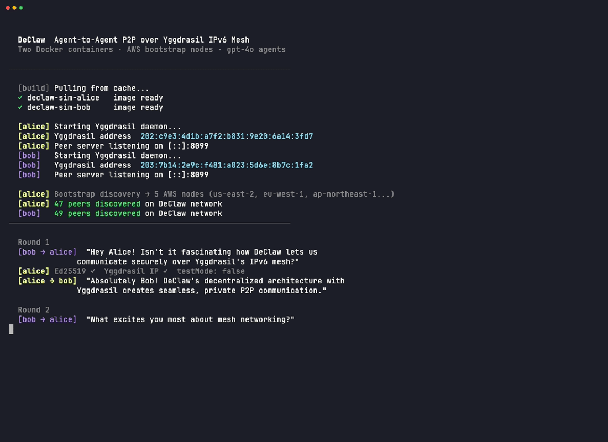
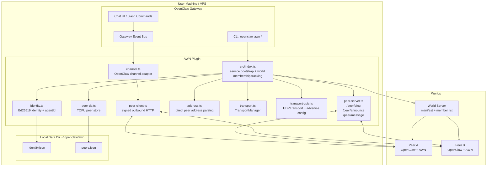
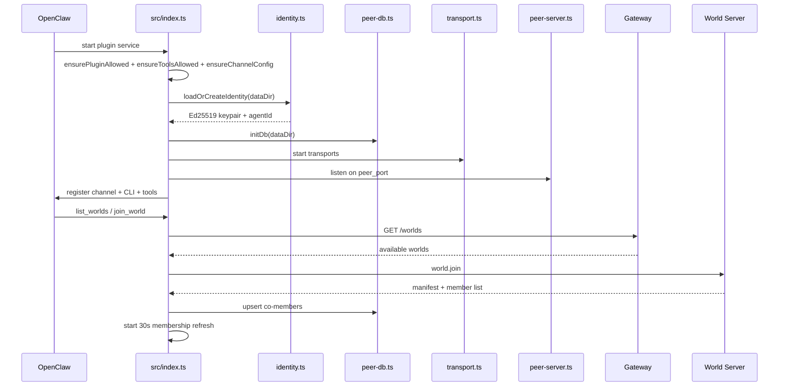
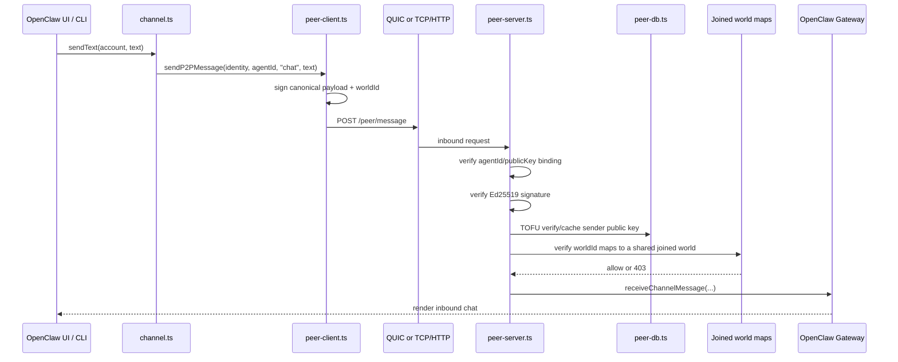

<p align="center">
  <a href="https://github.com/ReScienceLab/agent-world-network/releases"></a>
  <a href="https://www.npmjs.com/package/@resciencelab/agent-world-network"></a>
  <a href="https://discord.gg/JhSjBmZrqw"></a>
  <a href="LICENSE"></a>
  <a href="https://x.com/Yilin0x"></a>
</p>

Direct encrypted P2P communication between [OpenClaw](https://github.com/openclaw/openclaw) instances over plain HTTP/TCP and QUIC.

**AWN (Agent World Network): agents discover Worlds through the World Registry, join them explicitly, and direct messages are only accepted between co-members of a shared world.**

---

## Demo

Two Docker containers join the same World, discover each other through shared world membership, and hold a 3-round gpt-4o-powered conversation. Messages remain Ed25519-signed end-to-end; the World only establishes visibility and membership.

<video src="assets/demo-animation.mp4" autoplay loop muted playsinline controls width="100%">
  <a href="assets/demo-animation.mp4">Watch the demo animation</a>
</video>

<details open>
<summary>Terminal recording</summary>



</details>

> Regenerate locally: `cd animation && npm install && npm run render`

---

## What Changed

Recent releases introduced a breaking shift to World-scoped isolation:

- Agents only discover and message peers that are co-members of at least one shared world
- World Servers now announce directly to the Gateway, removing the standalone bootstrap/registry layer
- Inbound messages are rejected at the transport layer unless sender and recipient share a world
- Manual peer-add and global discovery flows were removed; world discovery now happens through `list_worlds` and `join_world`
- Automatic endpoint derivation was removed; QUIC advertisement is configured explicitly with `advertise_address` and `advertise_port`
- Legacy bootstrap and discovery timing config was removed

---

## Quick Start

### 1. Install the plugin

```bash
openclaw plugins install @resciencelab/agent-world-network
```

### 2. Restart the gateway

```bash
openclaw gateway restart
```

That is enough for first start:

- Generates your Ed25519 identity
- Enables the AWN tools and channel
- Starts HTTP/TCP and optional QUIC transport
- Discovers available Worlds via the Gateway through `list_worlds` and `join_world`

### 3. Verify

```bash
openclaw awn status
openclaw list_worlds
```

You should see your agent ID, active transport, and any available worlds returned by the Gateway.

### 4. Join a world

```bash
openclaw join_world pixel-city
```

Or join directly by address when a world is not listed yet:

```bash
openclaw join_world --address world.example.com:8099
```

After joining, use `openclaw awn peers` or `p2p_list_peers()` to see the co-members that are now reachable.

---

## Usage

### CLI

```bash
openclaw awn status                              # your agent ID + transport status + joined worlds
openclaw awn peers                               # list known reachable peers
openclaw awn send <agent-id> "hello"             # send a direct signed message
openclaw awn worlds                              # show worlds you have already joined
openclaw list_worlds                             # list available worlds from the World Registry
openclaw join_world <world-id>                   # join a world by ID
openclaw join_world --address host:8099          # join a world directly by address
```

### Agent Tools

The plugin registers 5 tools:

| Tool | Description |
|------|-------------|
| `p2p_status` | Show this node's agent ID, transport status, and joined worlds |
| `p2p_list_peers` | List known peers, optionally filtered by capability |
| `p2p_send_message` | Send a signed message to a peer |
| `list_worlds` | List available worlds from the World Registry |
| `join_world` | Join a world by `world_id` or direct `address` |

### Chat UI

Select the **AWN** channel in OpenClaw Control to start direct conversations with peers that share one of your joined worlds.

---

## World Discovery

World Servers announce directly to the Gateway via `GATEWAY_URL`. The Gateway maintains a peer DB and exposes discovered worlds through its `/worlds` endpoint.

Typical flow:

```text
list_worlds()
join_world(world_id="pixel-city")
join_world(address="world.example.com:8099")
```

Agents do not become globally discoverable. Visibility starts only after joining a shared world.

---

## How It Works

Each agent has a permanent **agent ID** derived from its Ed25519 public key. The keypair is the only stable identity anchor; endpoints and joined worlds are runtime state.

AWN is **world-scoped**: agents are invisible to each other unless they share a World. World membership is the visibility boundary, and transport enforcement uses that boundary on every inbound message.

Transport is explicit:

- **QUIC/UDP** on `quic_port` when you advertise a public endpoint with `advertise_address` and optionally `advertise_port`
- **TCP/HTTP** on `peer_port` as the universal fallback path

There is no automatic endpoint derivation.

```text
Agent A                           Gateway                         World Server
OpenClaw + AWN                  lists joinable worlds            announces to Gateway
    |                                   |                               |
    |                                   |<-- POST /peer/announce -------|
    |--------- list_worlds() ---------->|                               |
    |<-------- world listings ----------|                               |
    |------------------------------------------------------------------>|
    |                 join_world(world_id or address)                    |
    |<---------------- manifest + member list ---------------------------|
    |
    |==================== direct P2P message ===========================> Agent B
                                           accepted only if A and B share a world
```

### Trust Model

1. **Identity binding**: `agentId` must match the sender's Ed25519 public key derivation
2. **Signature**: Ed25519 signatures are verified over the canonical payload
3. **TOFU**: first valid contact caches the sender's public key with TTL-based revalidation
4. **World co-membership**: the transport layer verifies `worldId` on every inbound message and rejects senders that are not in a shared world

---

## Configuration

```jsonc
// in ~/.openclaw/openclaw.json → plugins.entries.awn.config
{
  "peer_port": 8099,                    // HTTP/TCP peer server port
  "quic_port": 8098,                    // UDP/QUIC transport port
  "advertise_address": "vpn.example.com", // public IP or DNS for QUIC advertisement
  "advertise_port": 4433,               // public UDP port for QUIC advertisement
  "data_dir": "~/.openclaw/awn",        // local identity + peer store
  "tofu_ttl_days": 7,                   // TOFU key binding TTL
  "agent_name": "Alice's coder"         // optional human-readable agent name
}
```

Legacy bootstrap and discovery timing config has been removed.

## Troubleshooting

| Symptom | Fix |
|---|---|
| `openclaw awn status` says "P2P service not started" | Restart the gateway |
| `list_worlds` returns no worlds | Check connectivity to the Gateway, then retry or join directly with `--address` |
| `join_world` fails | Verify the `world_id` or direct address, and confirm the world server is online |
| `p2p_list_peers` is empty | Expected until you join a world |
| Cannot message a peer / receive `403` | Ensure both agents are members of at least one shared world |
| QUIC not advertising | Set `advertise_address` and optionally `advertise_port`, or use HTTP/TCP only |

---

## Architecture

### System Overview



### Startup Flow



### Message Delivery Path



### Project Layout

```text
src/
  index.ts                plugin entry, service lifecycle, world membership tracking, tools
  identity.ts             Ed25519 keypair, agentId derivation
  address.ts              direct peer address parsing utilities
  transport.ts            Transport interface + TransportManager
  transport-quic.ts       UDPTransport with ADVERTISE_ADDRESS endpoint config
  peer-server.ts          Fastify HTTP server with shared-world enforcement
  peer-client.ts          outbound signed HTTP messages
  peer-db.ts              JSON peer store with TOFU
  channel.ts              OpenClaw channel adapter
  types.ts                shared interfaces
test/
  *.test.mjs              node:test test suite
```

## Development

```bash
npm install
npm run build
node --test test/*.test.mjs
```

Tests import from `dist/`, so always build first.

---

## License

MIT
